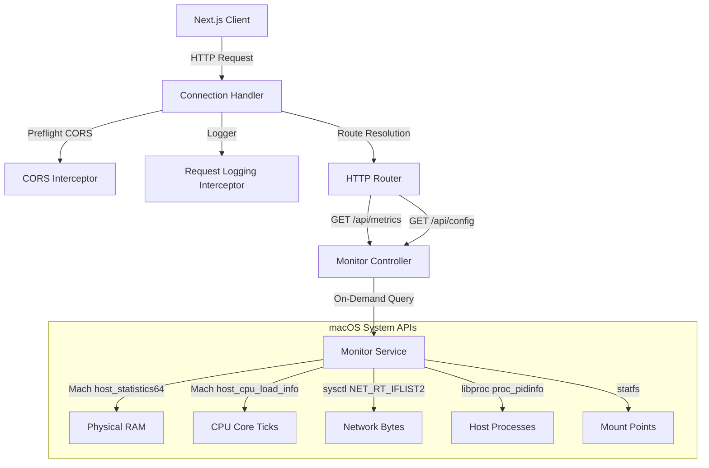

# macOS telemetry backend design doc

This document details the architectural design, implementation decisions, and technical specifications of the native C++ telemetry backend of `osxmon`.

---

## 1. Design goals & philosophy

The C++ backend is designed around three core principles:
1. **Zero-Overhead Idle**: The monitoring system must not impact the host performance it is measuring. When the dashboard is closed or paused, backend CPU consumption must be exactly **0%**.
2. **Mach Kernel & Sysctl Native Integration**: Access telemetry directly via private and public macOS system APIs rather than parsing command-line outputs (like `top` or `ps`), which introduces severe execution bottlenecks.
3. **Type-Safe, Self-Documenting REST API**: Use a modern REST architecture with compile-time JSON mapping and automatic OpenAPI documentation.

---

## 2. Component architecture

### 2.1. Server Core (`App.cpp` & `AppComponent.hpp`)
* **Framework**: Built on **Oat++ (v1.3.0)**, a high-performance C++ web framework.
* **Threading**: Uses the thread-pooled `HttpConnectionHandler` which scale-out natively to handle async/multithreaded connections.
* **CORS Policies**: Uses global CORS request and response interceptors to facilitate cross-origin requests from the containerized Next.js frontend.
* **Logging System**: A custom `RequestLoggingInterceptor` prints incoming requests (`GET`, `POST`) to standard output. Log levels can be modified dynamically at startup (`verbose`, `debug`, `info`, `warning`, `error`).

### 2.2. API Endpoints (`MonitorController.hpp` & `MonitorDto.hpp`)
* **JSON Mapping**: Uses compile-time Oat++ DTO macros (`DTO_INIT`, `DTO_FIELD`) to convert incoming payloads to C++ objects and outgoing data structures to JSON without runtime reflection.
* **OpenAPI Documentation**: Wire-mapped with Swagger UI. Accessing `http://localhost:8000/swagger/ui` hosts a dynamic test client loaded directly from compile-time documentation annotations.

---

## 3. macOS Telemetry details (`MonitorService.hpp`)

The backend extracts host statistics using native OS mechanisms:

### 3.1. CPU Usage
Uses the Mach host API to retrieve processor ticks:
* **API Call**: `host_processor_info` with `PROCESSOR_CPU_LOAD_INFO`.
* **Mechanism**: On each metrics request, the backend calculates the difference in CPU ticks (User, System, Idle, Nice) since the *last* request.
* **Formula**:
  $$\Delta \text{Ticks} = \text{Ticks}_{\text{current}} - \text{Ticks}_{\text{previous}}$$
  $$\text{CPU \%} = \frac{\Delta \text{Ticks}_{\text{active}}}{\Delta \text{Ticks}_{\text{total}}} \times 100$$

### 3.2. Physical Memory (RAM)
Queries the virtual memory statistics of the Mach host:
* **API Call**: `host_statistics64` with `HOST_VM_INFO64`.
* **State Mapping**:
  * **Wired Memory**: Pages locked in RAM (kernel allocations).
  * **Active Memory**: Pages currently in use by processes.
  * **Inactive Memory**: Pages recently freed but cached.
  * **Compressed Memory**: Pages compressed by the macOS memory compressor.
  * **Free Memory**: Unused pages.

### 3.3. Disk Storage
Monitors mounted volumes:
* **API Call**: `getfsstat` to list filesystems, followed by `statfs` on each active mount point.
* **Calculations**: Computes absolute size and used percentages for local drives (ignoring virtual/read-only loopback mount points).

### 3.4. Network Speeds
Tracks raw byte transfers across network interfaces:
* **API Call**: `sysctl` with `NET_RT_IFLIST2` to fetch routing socket metrics.
* **Speed Calculation**: Tracks delta bytes (`inputBytes` and `outputBytes`) divided by the delta time since the last poll.

### 3.5. Host Processes List
Gathers active process tables:
* **Listing**: `proc_listpids` with `PROC_ALL_PIDS` to retrieve active PIDs.
* **Metrics**: For each PID, query `proc_pidinfo` with `PROC_PIDTASKINFO` to fetch:
  * Resident Memory footprint (`pti_resident_size`).
  * Accumulated CPU times (`pti_total_user` and `pti_total_system`).
* **Delta Calculations**: Maintains an in-memory map of previous CPU times per PID. Stale PIDs are evicted automatically to prevent memory leaks.

---

## 4. Compilation & verification

The backend compiles natively on macOS:
* **Build System**: CMake (v3.15+).
* **Dependency Resolution**: Uses FetchContent to resolve dependencies:
  * `oatpp` (v1.3.0)
  * `oatpp-swagger` (v1.3.0)
* **Compiler Requirements**: Apple Clang (C++17 standard).
* **Test Suite**: Compiled under `oatppAllTests` and `module-tests`, validating controller routes, serialization reliability, and service memory bounds.
