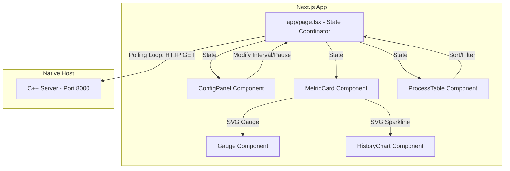

# Next.js frontend dashboard design doc

This document details the architectural design, user interface aesthetics, component structure, and state management of the `osxmon` Next.js frontend telemetry client.

---

## 1. Design goals & philosophy

The frontend application is built around three core goals:
1. **Premium, Premium Aesthetics**: Build a dashboard that matches or exceeds standard macOS design aesthetics. Use harmonized color palettes, dark modes, glassmorphism, responsive grids, and subtle micro-animations.
2. **Strict Polling Optimization**: Enable granular user control over request loops. Allow users to pause requests or adjust polling intervals to ensure zero network or host overhead when not in use.
3. **No External Charting Libraries**: Build charts, gauges, and tables using pure **inline SVGs and Vanilla CSS Modules**. This guarantees an extremely light bundle size, custom styling control, and smooth rendering transitions.

---

## 2. Frontend architecture

### 2.1. Coordinate Controller (`app/page.tsx`)
Acts as the global state machine and polling scheduler:
* **Dynamic Request Scheduler**: Utilizes `setInterval` linked to react state variables. If the polling interval changes, the current scheduler is torn down and rescheduled.
* **Polling Suspend**: Toggling the dashboard's "Pause" state cancels the active timer, halting all network calls instantly.
* **History Map**: Maintains an in-memory history array of the last 30 readings for active metrics to construct the sparkline charts.

### 2.2. Styling System (`index.css` & CSS Modules)
* **Design Tokens**: Defined as global CSS variables inside `index.css`:
  * Core colors: Deep obsidian backgrounds, dark slate panels, primary cyan glows, vibrant amber alerts.
  * Typography: Google Fonts `Inter` and `Outfit` for clean, professional data telemetry readouts.
* **Glassmorphism**: Achieved with `backdrop-filter: blur(16px)` and semi-transparent borders to give dashboard cards a premium frosted-glass appearance.

---

## 3. Implemented components

### 3.1. Animated Radial Gauges (`Gauge.tsx`)
A custom SVG-based meter rendering system:
* **Geometry**: Employs an SVG path representing a 270-degree arc (ranging from 135 degrees to 405 degrees).
* **Fill Calculations**: Computes the SVG `strokeDasharray` and `strokeDashoffset` dynamically:
  $$\text{Dashoffset} = \text{ArcLength} \times \left(1 - \frac{\text{Value}}{100}\right)$$
* **Visuals**: Styled with linear gradients (Cyan-to-Blue or Orange-to-Red) and a subtle SVG Gaussian drop-shadow filter to create a glowing neon overlay.

### 3.2. Historical Sparklines (`HistoryChart.tsx`)
Renders a trend graph over time:
* **Geometry**: Iterates through the coordinated history state and plots coordinate paths (`d="..."`) utilizing custom SVG height mappings.
* **Fills**: Applies a linear gradient stroke combined with a semi-transparent area fill underneath the path coordinates.

### 3.3. Telemetry Process Table (`ProcessTable.tsx`)
Displays active macOS process lists:
* **Sorting**: Implements a client-side sorting engine for **PID**, **Name**, **CPU %**, and **Resident Memory** footprint.
* **Searching**: Allows real-time query filtering using an input box.
* **Memory Formatting**: Automatically translates bytes to human-readable scales (MB, GB).

---

## 4. Containerization & host mapping

The frontend uses **Docker** to containerize Next.js in a production-ready environment:
* **Dockerfile**: Employs a multi-stage compilation pipeline:
  * **Stage 1 (Builder)**: Installs npm packages and executes `npm run build` using Next.js standalone outputs.
  * **Stage 2 (Runner)**: Copies compiled standalone build items into a minimal node-alpine container.
* **Docker Compose Mapping**: Maps host port `3000` to container port `3000`. It configures `extra_hosts` to route requests to the native C++ API using `host.docker.internal:host-gateway`.
* **Zero-Warning Config**: Configured using standard V2 syntax without deprecated properties to ensure warning-free compilation.
